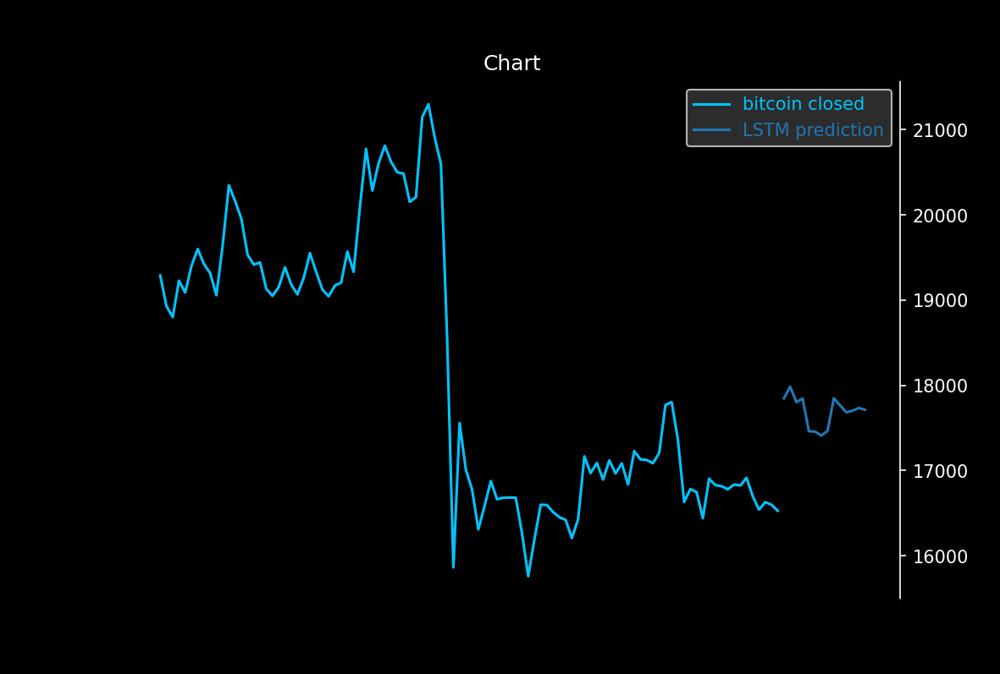
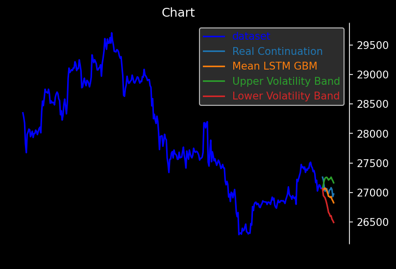

<h1 align=center>ChartPeer SDK</h1> 

A developer kit with a user-friendly API to various technical analysis tools for traders.

- Indicators
- Regression
- Stochastic Prediction
- Machine Learning
- Plotting

Works great in Jupyter environments (also see [VSCode Extension](https://github.com/Microsoft/vscode-jupyter)).

<br>

# Getting Started
## Install 
```bash
git clone https://github.com/B0-B/chartPeer-trading 
cd chartPeer-trading/ChartPeer-SDK 
# on windows
python setup.py install 
# on debian
sudo python3 setup.py install
```

## Usage

```python
from chartpeer.loader import load
from chartpeer.extrapolate import lstm
from chartpeer.analysis import plot

# load bitcoin daily data (1440 minutes = 24h interval)
# extract the last 365 days
data = load.closedFromFile('XBTUSD_1440.csv')[-365:]

# initialize an LSTM network which predicts prices of next 14 days based on the previous 60 days, 
# for training all 365 days are sliced into training sets
nn = lstm(sequence_length=60, feature_length=14, epochs=50,  batch_size=10)
output = nn.predict(data) 
prediction = output['prediction']

# plot prediction
plot.chart(data, name='bitcoin closed', predictionSets = {
    'LSTM prediction': prediction
})
```



Obviously generic LSTM can be quiet off, hence `lstm_gmb` offers a new geometric brownian motion algorithm supported by LSTM for improved timeseries prediction. Read the paper [LSTM-driven Monte Carlo for Geometric Timeseries Forecast](). The following code example requests recent bitcoin price data and predicts the outcome.

```python
from chartpeer.loader import krakenApi, load
from chartpeer.extrapolate import lstm_gbm
from chartpeer.analysis import plot

# load ohlc and convert to closed prices
ohlc = krakenApi.ohlc('BTC', 60)
closed = load.closedFromOhlc(ohlc)[-365:]

# predict for 14 intervals of e.g. minutes, hours, days etc.
feature_length = 14
smoothing = 10

# split into Input (for training) and target set
Input = closed[:-feature_length]
target = closed[-feature_length:]

# train for 20 epochs volatility, and 10 epochs the geometric trend
output = lstm_gbm(Input, feature_length, epochs=(20,10), smoothing=smoothing)

plot.chart(Input, predictionSets = {
    'Real Continuation': target,
    'Mean LSTM GBM': output['mean'],
    'Upper Volatility Band': output['upper'],
    'Lower Volatility Band': output['lower']
})
```



## Examples

More examples can be found within the [tutorial](https://github.com/B0-B/chartPeer-trading/blob/main/ChartPeer-SDK/tutorial.ipynb) and [live prediction](https://github.com/B0-B/chartPeer-trading/blob/main/ChartPeer-SDK/lstm_gbm_live_prediction.ipynb) notebooks.
