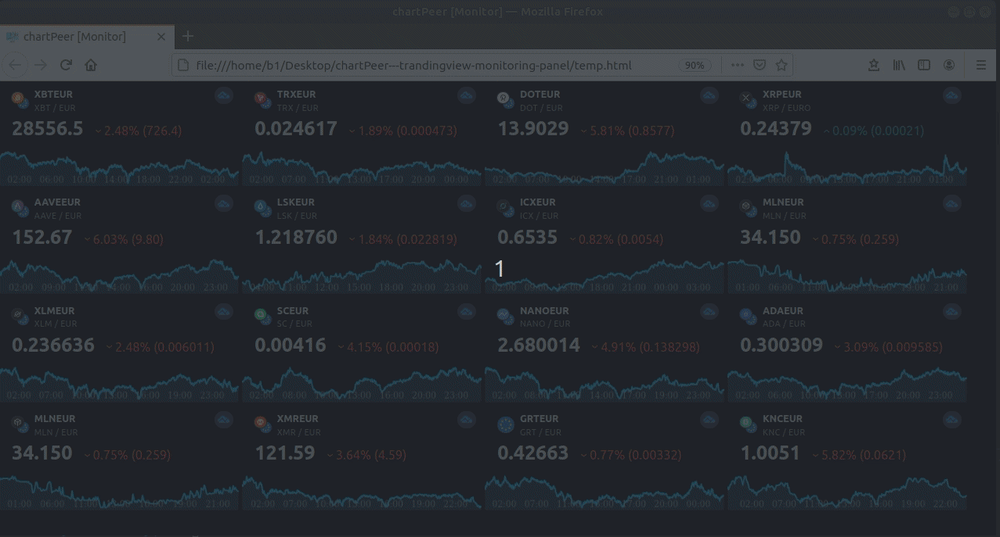

# chartPeer  [](https://twitter.com/intent/tweet?text=For%20the%20men%20who%20stare%20at%20charts&url=https://github.com/B0-B/chartPeer---tradingview-monitoring-panel&hashtags=chart,trading, analysis,ticker,tradingview,livedata)

<br>

### *For the men who stare at charts.*  :goat:

<br>



<br>

## A decent & scalable chart panel monitor
To declare an arbitrary amount of assets/instruments (watch list) insert tradingview-compliant (MARKET:SYMBOL e.g. "NASDAQ:AAPL")
symbols in the configuration section in `config.yml`. Customize the colors and 'epoch' (total time - 12 months is default) by your taste.


```yaml
assets:
  # put any asset on your watch list
  # search for assets here: https://www.tradingview.com/widget/technical-analysis/
  - KRAKEN:XBTEUR
  - KRAKEN:TRXEUR
  - KRAKEN:DOTEUR
  - KRAKEN:XRPEUR
  - KRAKEN:AAVEEUR
  - KRAKEN:LSKEUR
  - KRAKEN:ICXEUR
  - KRAKEN:MLNEUR
  - KRAKEN:XLMEUR
  - KRAKEN:SCEUR
  - KRAKEN:NANOEUR
  - KRAKEN:ADAEUR
  - KRAKEN:MLNEUR
  - KRAKEN:XMREUR
  - KRAKEN:GRTEUR
  - KRAKEN:KNCEUR

background: rgba(0, 0, 0, 1)  

color: rgba(3, 177, 252, 1)

colorShade: rgba(3, 177, 252, 0.15)

epoch: 1D # possible epochs: 1D, 1M, 3M, 6M, 1Y, 5Y, ALL
```
## everything you need in 7kB 
:heavy_check_mark: Responsive <br>
:heavy_check_mark: No Dependencies <br>
:heavy_check_mark: Frame Embedment <br>
:heavy_check_mark: Customizable <br>
:heavy_check_mark: Quick and Useful for day trading <br>
:heavy_check_mark: tested in Chrome & Firefox <br>

## Usage
```bash 
~$ python chartPeer.py
```

